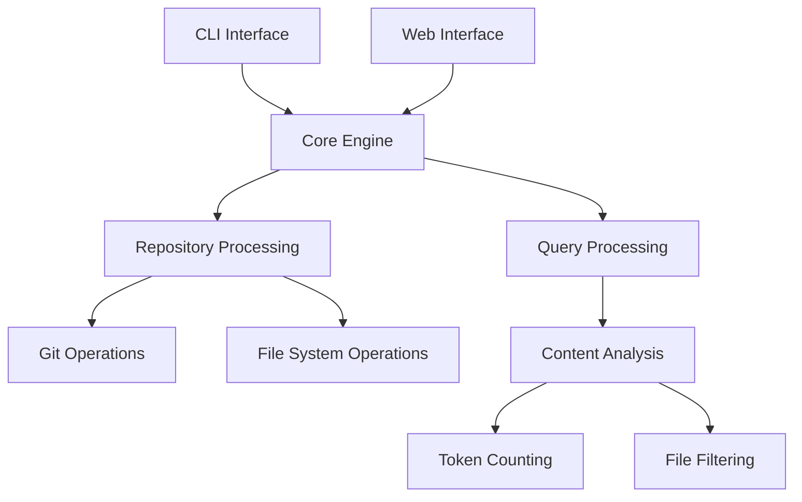
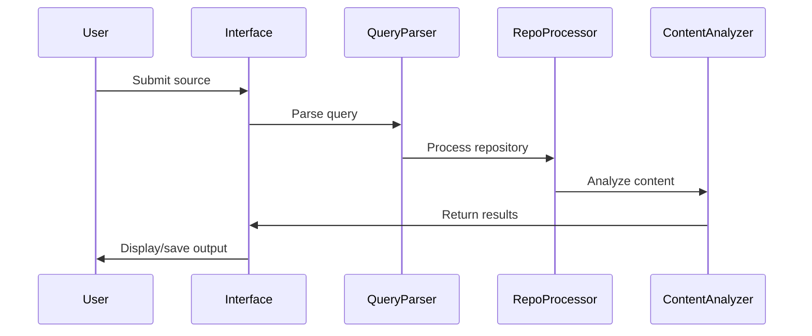

# Gitingest Architecture Documentation

This document provides a comprehensive overview of the Gitingest architecture, designed to be useful for both human readers and LLMs analyzing the codebase.

## Table of Contents
- [System Overview](#system-overview)
- [Architecture Components](#architecture-components)
- [Core Components Deep Dive](#core-components-deep-dive)
- [Data Flow](#data-flow)
- [Configuration & Customization](#configuration--customization)
- [Integration Points](#integration-points)
- [Development Guidelines](#development-guidelines)

## System Overview

Gitingest is a tool that converts Git repositories into LLM-friendly text format. It provides multiple interfaces (CLI, Python package, Web API) to analyze repositories and create digestible text summaries optimized for use in LLM prompts.

### Core Value Proposition
- Simplifies code context sharing with LLMs
- Provides smart formatting optimized for LLM prompts
- Offers flexible integration options
- Maintains repository structure information

### Key Features
- Repository analysis and text digest generation
- File and directory structure preservation
- Size and token count statistics
- Multiple interface options (CLI, API, Python package)
- Browser extension support
- Smart file filtering and pattern matching

### System Requirements
- Python 3.8+
- Core Dependencies:
  - click: CLI interface
  - FastAPI: Web server
  - tiktoken: Token counting
  - Jinja2: Template rendering

## Architecture Components



The architecture follows a modular design with clear separation of concerns:
- Interface Layer: CLI and Web interfaces
- Processing Layer: Repository and query handling
- Analysis Layer: Content processing and token counting
- Storage Layer: File system operations

## Core Components Deep Dive

### CLI Interface (`src/gitingest/cli.py`)
The CLI provides the command-line interface for direct repository analysis:

```python
@click.command()
@click.argument("source", type=str, default=".")
@click.option("--output", "-o", default=None, help="Output file path")
@click.option("--max-size", "-s", default=MAX_FILE_SIZE, help="Maximum file size")
@click.option("--exclude-pattern", "-e", multiple=True, help="Patterns to exclude")
@click.option("--include-pattern", "-i", multiple=True, help="Patterns to include")
@click.option("--branch", "-b", default=None, help="Branch to clone")
```

Key Features:
- Flexible source input (local path or repository URL)
- Customizable output location
- Pattern-based file filtering
- Branch selection
- File size limits

### Web Server (`src/server/main.py`)
The FastAPI-based web server provides HTTP endpoints and web interface:

Key Components:
- Rate limiting middleware
- Static file serving
- Template-based rendering
- API documentation
- Health check endpoint

Routes:
- `/`: Main interface
- `/api/`: API documentation
- `/health`: Health check endpoint
- Dynamic repository processing endpoints

### Repository Processing (`src/gitingest/repository_ingest.py`)
Handles repository cloning and content extraction:

Key Features:
- Asynchronous processing
- Temporary storage management
- File size validation
- Pattern matching
- Branch selection

### Query Processing
The query processing pipeline includes:

1. Query Parsing:
   - URL/path detection
   - Parameter extraction
   - Pattern compilation

2. Content Analysis:
   - File filtering
   - Content extraction
   - Token counting
   - Structure preservation

## Data Flow



## Configuration & Customization

### Environment Variables
- `ALLOWED_HOSTS`: Comma-separated list of allowed hosts
- Default: "gitingest.com, *.gitingest.com, localhost, 127.0.0.1"

### File Patterns
- Include/exclude patterns for file filtering
- Default exclusions for common non-code files
- Support for custom pattern sets

### Size Limits
- Default max file size: 10MB
- Configurable through CLI/API
- Prevents processing of large binary files

### Output Formats
- Text-based output optimized for LLMs
- Directory tree visualization
- File content with structure preservation
- Statistical summaries

## Integration Points

### Python Package Usage
```python
# Synchronous
from gitingest import ingest
summary, tree, content = ingest("path/to/directory")

# Asynchronous
from gitingest import ingest_async
import asyncio
result = asyncio.run(ingest_async("path/to/directory"))
```

### CLI Integration
```bash
# Basic usage
gitingest /path/to/directory

# URL processing
gitingest https://github.com/user/repo

# Custom output
gitingest /path/to/directory -o output.txt
```

### Web API Endpoints
- GET `/`: Web interface
- GET `/api/`: API documentation
- POST `/process`: Process repository
- GET `/health`: Health check

### Browser Extension
- Chrome/Firefox/Edge support
- Direct repository processing
- URL pattern matching
- Integration with web interface

## Development Guidelines

### Code Organization
```
src/
├── gitingest/       # Core package
│   ├── cli.py       # CLI interface
│   ├── config.py    # Configuration
│   └── ...         # Core modules
├── server/         # Web server
│   ├── main.py     # Server entry
│   ├── routers/    # API routes
│   └── templates/  # Web templates
└── static/         # Static assets
```

### Testing Approach
- Pytest for unit/integration tests
- Async test support
- Mocked Git operations
- Coverage tracking

### Best Practices
1. Asynchronous Operations
   - Use async/await for I/O operations
   - Proper error handling
   - Resource cleanup

2. Error Handling
   - Custom exception types
   - Graceful degradation
   - User-friendly error messages

3. Performance
   - File size limits
   - Rate limiting
   - Efficient file processing
   - Temporary file cleanup

4. Security
   - Host validation
   - File size restrictions
   - Pattern filtering
   - Input sanitization

### Contribution Workflow
1. Fork repository
2. Create feature branch
3. Implement changes
4. Add tests
5. Submit pull request

This architecture documentation provides a comprehensive overview of the Gitingest system, suitable for both human developers and LLMs to understand and work with the codebase effectively.
